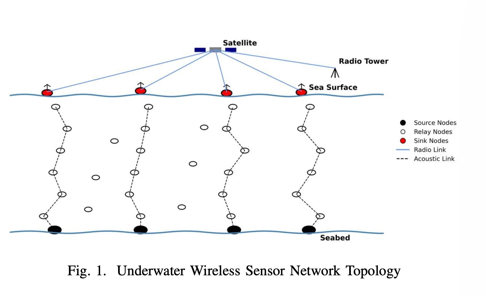
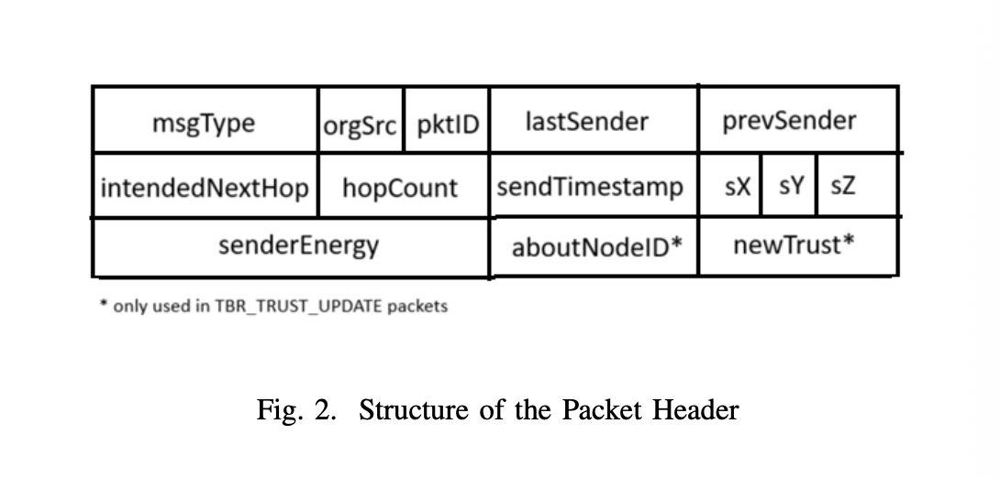
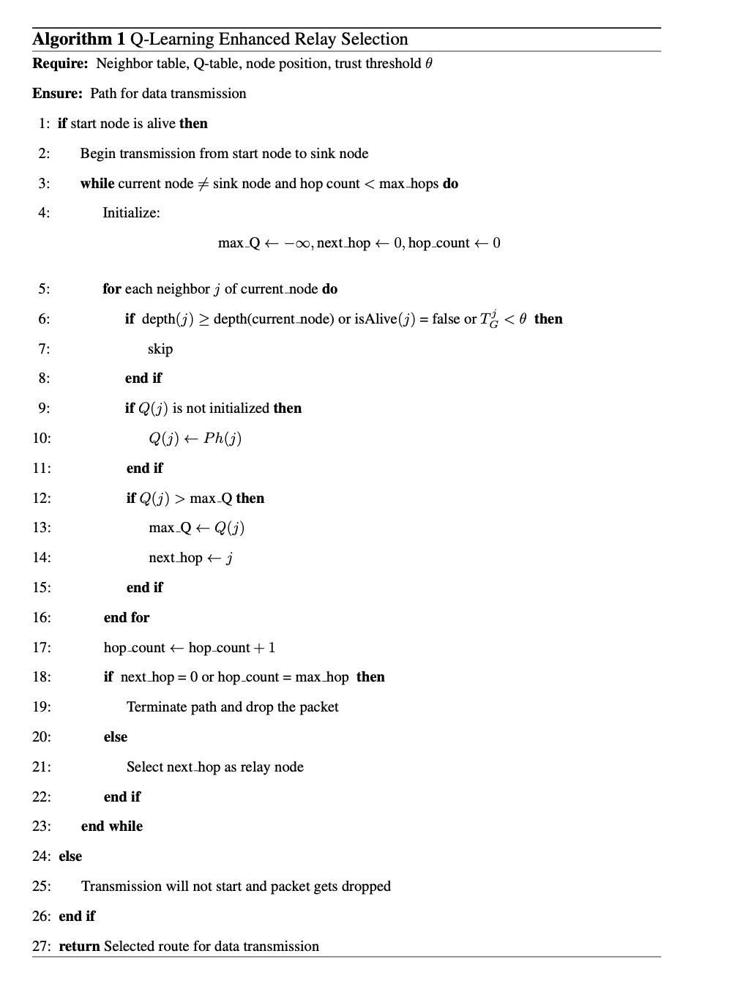
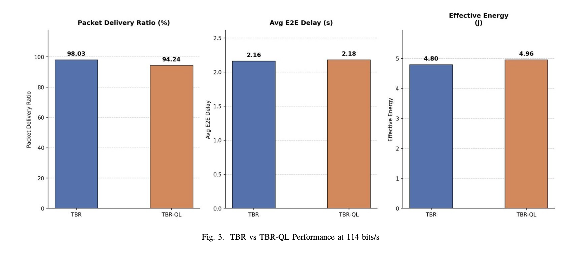
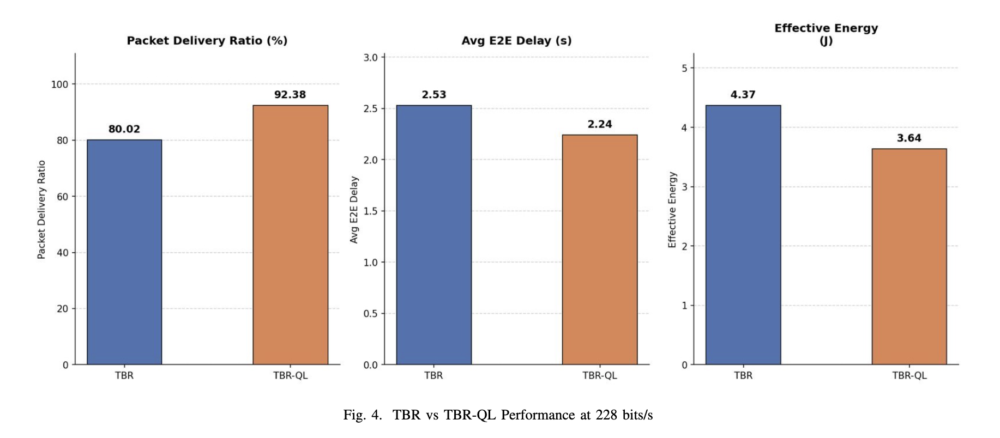
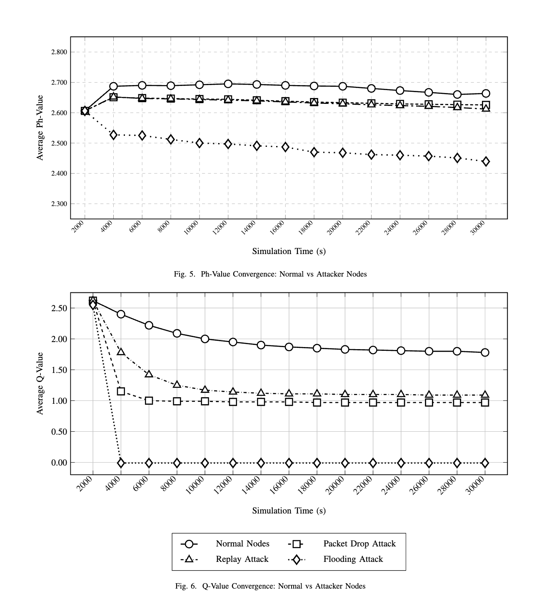

# TBR-QL: Q-Learning Enhanced Trust-Based Routing for Secure UWSNs

TBR-QL is a secure routing protocol for Underwater Wireless Sensor Networks (UWSNs) that combines Trust-Based Routing (TBR) with Q-Learning to improve relay selection under malicious attacks.

Implemented and evaluated using NS-3.41 and AquaSim-NG.

## Network Architecture

## Packet Header

## Protocol for Relay Selection

## Key Features

- **Trust-Aware Secure Routing**  
  Evaluates neighboring nodes based on forwarding behavior and trust scores to avoid unreliable or malicious relays.

- **Q-Learning Based Relay Selection**  
  Uses reinforcement learning to dynamically select forwarding nodes by considering trust, residual energy, propagation delay, and depth advancement.

- **Asymmetric Reward and Punishment Mechanism**  
  Applies faster penalties for malicious behavior and slower recovery for previously untrusted nodes, improving resilience against on-off attacks.

- **Mixed On-Off Attack Model**  
  Simulates realistic underwater network threats where malicious nodes periodically switch between normal and attack states while performing multiple attack types.

- **NS-3.41 + AquaSim-NG Implementation**  
  Fully implemented and evaluated in the NS-3.41 simulator using the AquaSim-NG underwater networking framework.

## Results

### Performance Comparison of TBR vs TBR-QL at 114 bits/s

### Performance Comparison of TBR vs TBR-QL at 228 bits/s

### Ph-Value Vs Q-Value Convergence

## Authors

- Abhishek Jain(Research paper)
- Krish Arora(Main Developer)
- Sujal Goel(Main Developer)

### Guided By

Dr. Mohit Sajwan  
Department of Information Technology  
NSUT

## Research Manuscript

📄 [Read the Research Paper](TBR-QL-Research_Paper.pdf)

Status: Unpublished Research Project
